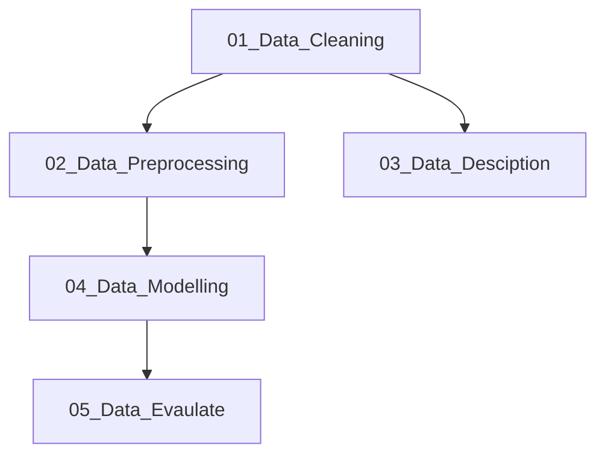

# Secondhand car price estimation of Hungary with machine learning

This project was created as a reference project for my Machine Learning study.

## Problem Statement

Approximately 600 000 used cars change owner for a year in Hungary. Most of people hard to define how much their car price. Sometimes looking for car same condition like their or ask some proffesional car dealer for this. 
    In my project I try to find soulution with machine learning tools.
    

## Raw Data

The source of data has made from online secondhand car shop, which I gathered by python beautifulsoup extension. (The webscarp process does not contain the repository.) I scarped the most common cars like OPEL, RENAULT, SUZUKI, HONDA, MITSHUBISI etc.

### Flowchart

Files | File Description
------------ | -------------
01_Data_Cleaning.ipynb |Create unified data types, and filter rows
02_Data_Description.ipynb |Visualize the data for preprocessing
03_Data_Preprocessing.ipynb |Transfrom data set to numeraical values, feature engineering
04_Data_Model_prep.ipynb |Select,setup and fine the model parameters
05_Data_Model_Eval.ipynb |Evalualte the model

## Data Clean

The starting dataset contain the useful features to the further analysis and I made some replace for clean this.

## Data model

Before the data modelling a decided a will use regression technics because, the target feature has high variance. I tried some of method from scikit-learn library, and the winner was the RandomForest method.
Tune the hyper pararameter with GridSearchCV, and the error metric was mean absoulte error.

